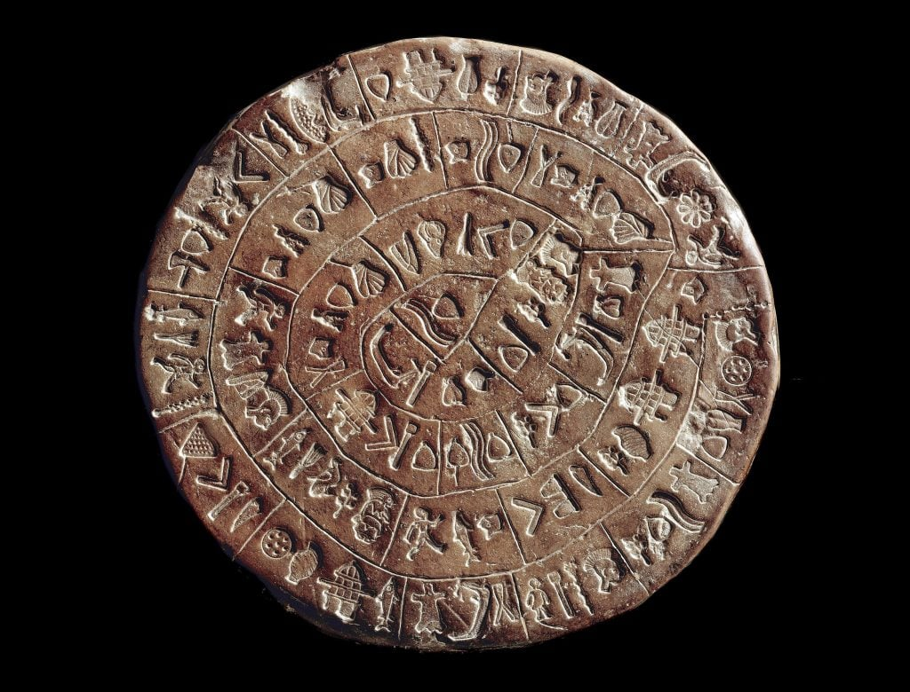
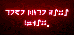
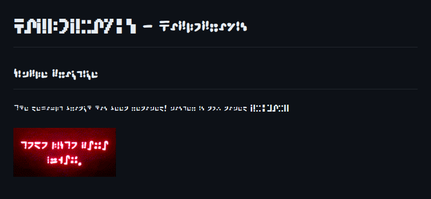

#  - Haplopraxis

## Phaistos Disc

The Phaistos Disc is a famous archaeological find from the Minoan civilization, discovered in the Minoan palace of Phaistos. It is a unique disc made of fired clay, featuring a spiral of stamped symbols.

<!--

https://standardgalactic.github.io/vectorspace/#/galaxy/word2vec-wiki?cx=-3208&cy=-8930&cz=2898&lx=-0.2059&ly=-0.6299&lz=-0.5451&lw=0.5135&ml=300&s=1.75&l=1&v=d50_clean

The default branch has been renamed!
master is now named   (now named primary)

-->
This page is live at [https://standardgalactic.github.io/haplopraxis](https://standardgalactic.github.io/haplopraxis)

