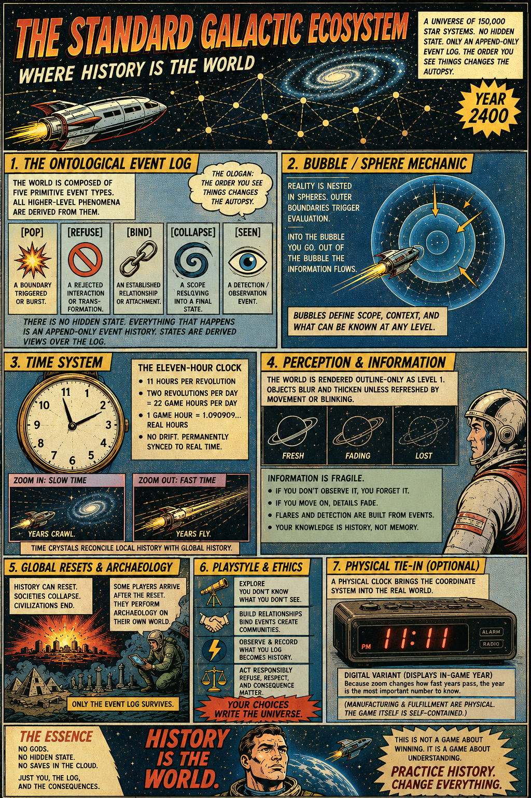

[Haplopraxis — Design Notes](https://standardgalactic.github.io/haplopraxis/haplopraxis-design-document.pdf)

[Universal Resource and Fabrication Network](https://standardgalactic.github.io/haplopraxis/urfn-ccfa-constitutional-spec.pdf)

[Developmental Opacity](https://standardgalactic.github.io/haplopraxis/developmental-opacity.pdf)

# Haplopraxis (Starfield edition)

A tiny web game where history is the world — now with a navigable starfield.

What’s new
- Canvas starfield with a controllable ship. Focus planets to interact.
- Press Space while a planet is in the reticle to trigger that affordance (same effects as clicking).
- Ship movement affects encounter ordering — the order you see things changes the autopsy.
- Hidden-rule system now emerges from historical interactions (ordering, lag, ancestry, and singular mutation), not typed triggers.
- Save / Load, Export / Import, Replay, Sample-lineage, toasts, and audio feedback retained.
- Keyboard shortcuts: see the control panel (press C).

How to play
1. Open `index.html`.
2. Move with WASD. Use Q/E/H/L/J/K/R/F for extra view control (see the in-page control panel).
3. Bring planets into the center reticle and press Space to interact.
4. Use the UI buttons to Save, Load, Export, Import, Replay, or start a New Lineage fork.

Bash mini-game
- Run `bash 20-questions.sh` for a terminal 20 Questions game.

Files of interest
- `index.html` — main page (now includes the starfield canvas)
- `styles.css` — UI + starfield overlay styling
- `hidden_rules_engine.js` — compositional historical hidden-rule engine
- `game.js` — starfield runtime + UI integration (save/load/export/import/replay/lineage)
- `hidden-rules-games.md` — compendium of games with hidden/unknown rules (Easter egg target)
- `sample-lineage.json` — example lineage
- `analysis-tools/haplopraxis_analysis.py` — repository-specific NumPy/SymPy/NLTK analysis toolkit
